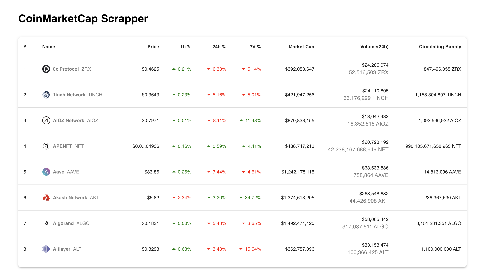

# CoinMarketCap Scraper
The CoinMarketCap Scraper is a web scraper application designed to fetch data from CoinMarketCap at regular intervals.

It sends POST requests to a backend API and stores the retrieved data in a PostgreSQL database.

The frontend component continuously polls the backend for updated data and presents it in an infinitely scrolled table for a seamless user experience.

# Scraper Recording
https://drive.google.com/file/d/1R-vEw7R1ZLr9W0D1g2-rcSfJFg3UOOWB/view?usp=sharing

# Website Recording
https://drive.google.com/file/d/1MFgVW8JNqv1v2mVPedlW16I9-Cany8T9/view?usp=sharing

## Local Development Setup

### Prerequisites
Before running the application on your local machine, ensure you have the following prerequisites set up:

- PostgreSQL: Set up a PostgreSQL database for storing scraped data.
- Redis: Install Redis for Celery task queue management.
- Pipenv: Use Pipenv for managing Python dependencies.
- Chrome Browser: Keep the Chrome browser installed, as the app primarily uses it for web scraping.

### Base Setup

- Clone the repository to your local machine.
- Set up the environment by creating a .env file based on .env.template and populate the necessary entries.

### To run the application on Local machine:

- Activate the virtual environment using Pipenv: `pipenv shell` & `pipenv install`
- Run the Django development server: `python manage.py runserver`
- Start the Celery worker and beat scheduler: `celery -A coinmarketcap_scraper.celery worker -l info -B`
